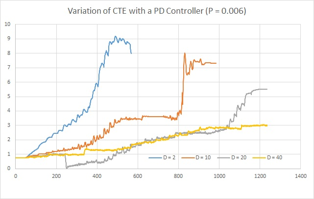
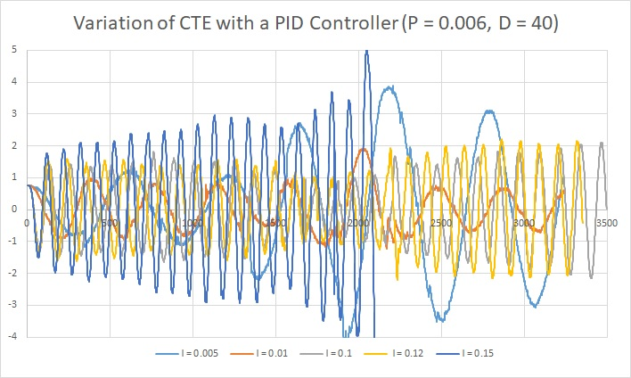

# Project - 04: PID Control

---
## Introduction

This project required us to design a PID (proportional/integral/differential) controller for the vehicle to run in the unity based simulator. There were primarily two steps involved. One, to come up with the initial P-I-D values so that the car can move on the track reasonably. Two, the P-I-D values be tuned by applying the general processing flow as described in the earlier lessons or otherwise. The sensors from the simulated vehicle provides cross-track error (CTE), speed, and steering angle data via the local websocket which the PID controller should use to generate the appropriate actuating command for steering and throttle (optional).

## Reflection on the Implementation w.r.t. the Rubric

- *Describe the effect each of the P, I, D components had in your implementation.*

The P, or the "Proportional" component provides the "Stiffness" to the dynamical system. It acts like a spring in a spring-mass-damper system. Like a spring pulls (or, pushes) with more force when the mass moves farther away from the neutral position, the P-parameter provides sharper steering when the car is far away from the central line of the road. As the car comes closer and closer to the center, the steering becomes less and less severe. It behaves exactly like the F = -kx term in the spring system. 

The D, or "Differential", component counteracts the P component's tendency to ring and overshoot the center line. A properly tuned D parameter will cause the car to approach the center line smoothly without ringing.

The I, or "integral", component counteracts a bias in the CTE which prevents the P-D controller from reaching the center line. This bias can take several forms, such as a steering drift (as in the Control unit lessons), but I believe that in this particular implementation the I component particularly serves to reduce the CTE around curves.

- *Describe how the final hyperparameters were chosen.*

Hyperparameters were tuned manually at first. This was necessary because the narrow track left little room for error, and when attempting to automate parameter optimization (such as Twiddle) it was very common for the car to leave the track, thus invalidating the optimization. Once I found parameters that were able to get the car around the track reliably, I then implemented Twiddle. I felt it necessary to complete a full lap with each change in parameter because it was the only way to get a decent "score" (total error) for the parameter set. For this reason my parameter changes are allowed to "settle in" for 100 steps and are then evaluated for the next 2000 steps. In all, I allowed Twiddle to continue for over 1 million steps (or roughly 500 trips around the track) to fine tune the parameters to their final values (P: 0.134611, I: 0.000270736, D: 3.05349).

---

